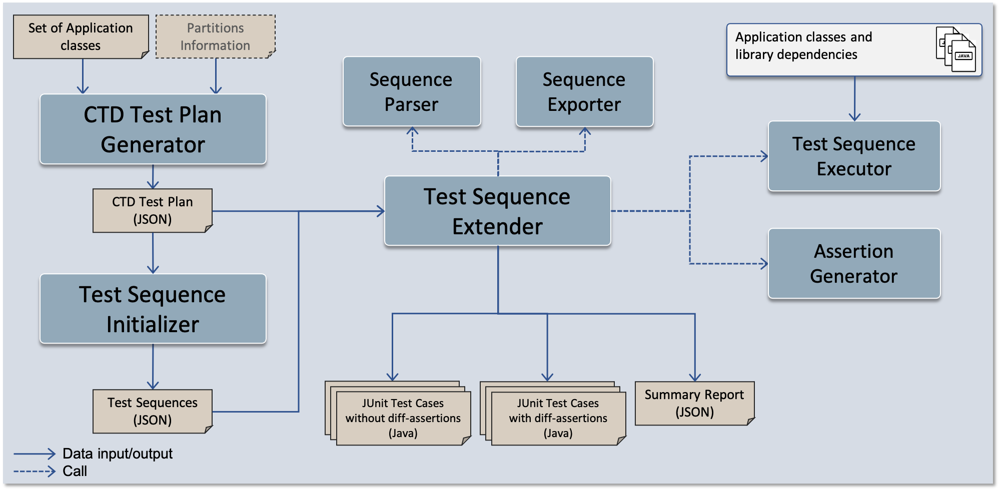

# Tackle Test Generator Core

This repository contains the core components of the Tackle-Test tooling for performing automated test generation and differential testing on two application versions (in the context of application modernization). These components are invoked via the [Tackle-Test CLI](https://github.com/konveyor/tackle-test-generator-cli).

The main capabilities enabled by these tools are:

1. Automated generation of JUnit test cases using different strategies: adaptive random, code-coverage based, and CTD-amplified coverage goals.

    This feature leverages two open-source automated unit-test generation tools for Java: [Randoop](https://randoop.github.io/randoop/), which performs adaptive-random test generation, and [EvoSuite](https://www.evosuite.org/), which applies evolutionary algorithms to generate tests that are directed toward achieving code-coverage goals (_e.g._, method, statement, branch, and exception coverage).

    Additionally, a third test-generation strategy applies combinatorial test design (CTD) to generate test cases that exercise methods using various combinations of subtypes of the declared method parameter types. CTD modeling optimizes the type combinations that computed as coverage goals, while also enabling the selection of different interaction levels.

2. Automated addition of assertions to the test cases to enable differential testing. This is done by executing test sequences, and observing program states during execution, on the monolith. Based on the observed program states, assertions are generated to check that the same program states occur in the transformed application during test execution. The goal in creating these assertions is to detect meaningful differences in observable program states that indicate transformation bugs or broken functionalities in the transformed application.

## Building the Tool

The tool can be built using `maven`, following these steps:

1. From the folder `tackle-test-generator-unit`, download Randoop jars
   ```dtd
   mvn download:wget@get-randoop-jar download:wget@get-replacecall-jar
   ```

2. Add the following server entry to Maven `settings.xml` (`~/.m2/settings.xml`; create one if
   it doesn't exist), replacing `USERNAME` with your GitHub username and `PASSWORD` with your
   password or a personal access token. This is needed for downloading the specific builds of
   EvoSuite jars that are hosted in a [Maven registry on GitHub Packages](https://github.com/sinha108/maven-packages/packages).
   ```
   <servers>
     <server>
     <id>github-sinha108</id>
     <username>USERNAME</username>
     <password>PASSWORD</password>
    </server>
   </servers>
   ```

3. Build test-generator-core jar
   ```dtd
   mvn package
   ```
CTD modeling and test-plan generation is done using the [NIST Automated Combinatorial Testing for Software](https://csrc.nist.gov/projects/automated-combinatorial-testing-for-software) tool, which is packaged with the test generator (in the `lib` directory).

## Tool Usage

Although the components in this repository provide programming APIs and can also be invoked from the command line, the primary mechanism for usage of the core components is via the [Tackle-Test CLI](https://github.com/konveyor/tackle-test-generator-cli), which provides various commands and configuration options for invoking the core
components.

## Components of the Toolchain

This following figure illustrates the various components of Tackle Test Generator Core, and the input/output from each component.



The primary components among these are:

1. The CTD Test-Plan Generator: It takes as input a set of application classes on which it performs static analysis to create a CTD model for each public method in the classes. Each model is then run through CTD optimization, which produces a _test plan_ for a method. The test plan for a method consists of a set of rows, each of which is a coverage goal, specifying a combination of types for method parameters. The output of the test-plan generator is a consolidate test plan (in JSON format) for all public methods of all classes provided as input.

    If particular application classes as not provided as input, the test-plan generator analyzes all application classes, which it discovers via user-provided classpath configuration.

2. The Test-Sequence Initializer: This component takes as input a CTD test plan and leverages Randoop and EvoSuite test cases generators, targeting them at the classes occurring in the test plan, to generate test sequences for public methods of the classes, as well as for constrcutors of parameter types appearing in the CTD test plans. A test sequence for a target method consists of a "setup sequence" that sets up the receiver object state (if the target method is virtual) and actual parameters of the target method, followed by a call to the target method. The output of this component is a set of "initial" test sequences that serve as building blocks for the synthesis of extended test sequences for covering the test-plan rows. The test sequences are stored in a stringified form in a JSON file.

3. The Test-Sequence Extender: This is the final step in the creation of CTD-amplified tests. The extender takes as input the CTD test plan and the building-block test sequences. It iterates over each row in the test plan and attempts to synthesize a test sequence that covers the row; _i.e..,_ the sequence invokes the target method with the parameter-type vector specified in the row. The extender does this by first creating a pool of sequences from the building-block sequences and then sampling from the pool to create subsequences for types required for a test plan. These subsequences are concatenated, with a call to the target method added at the end, to construct the covering or extended test sequence.

    After constructing an extended sequence, the extender runs the sequence in-memory (via reflection) to check whether the sequence executes successfully (_i.e.,_ whether the sequence is a valid sequence). Failing test sequences are discarded.

    The extender can, optionally, also add assertions to test cases. To do this, the extender executes a sequence in-memory (via reflection), accesses the public states of objects constructed during test execution, and creates assertions on those states. Assertions are added after every statement of the sequence which creates new objects. To handle non-determinism in run-time state, a sequence can be executed multiple times (via a configurable option) and an assertion on an object field is created only if the same value is seen in all executions.

    The output from the extender consists of JUnit test classes and summary reports.

## Code of Conduct
Refer to Konveyor's Code of Conduct [here](https://github.com/konveyor/community/blob/main/CODE_OF_CONDUCT.md).
